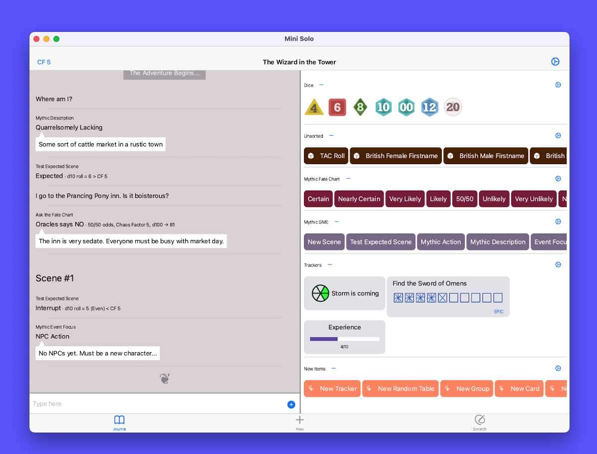

# Mini Solo App POC

This is an app to allow you to run TTRPG games solo on your device or desktop.

## Features

- Run separate campaigns
- Random dice roller for several systems
- Flexible widget library that can be used for
  - Character Sheets
  - Adventure Trackers
- Widgets include:
  - Ironsworn trackers
  - Countown Clocks
  - Pips
  - Bars
  - Counters
  - Fate Aspects
- Create own Random Tables
  - Paste simple plain text lists of items
  - Link random table results to other random tables or actions
- Create action lists to build results from multiple random tables and other action lists
- Card widgets can be used for displaying data
  - Character statistics
  - Lists of items
  - Tabular layout for weapon blocks etc
- Create Groups to group widgets and buttons as you need
- Scratch pad for quick notes
- Import/Export data as JSON

---

## Developer Notes

- `./scripts/coverage.sh` run coverage
- `./scripts/regenerate.sh` rebuild json annotations
